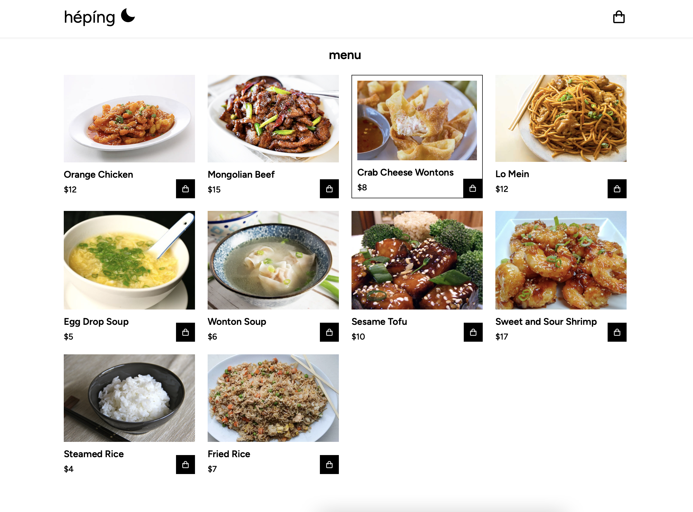
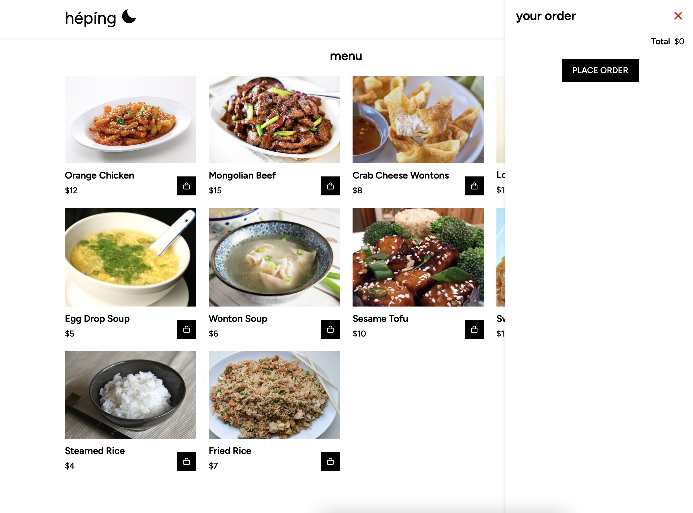
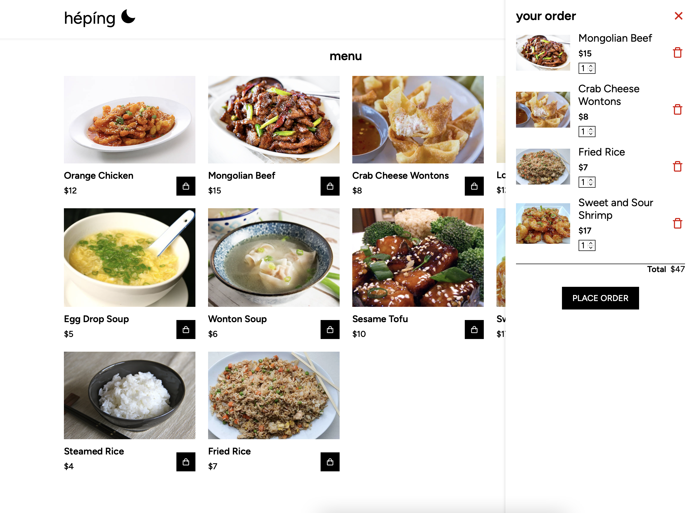

# Hépíng
Front-end e-commerce application designed as a menu, with functioning cart feature

### Tech used:

[![HTML/JSP][HTML.com]][HTML-url]
[![CSS][CSS]][CSS-url]
[![Javascript][Javascript]][Javascript-url]

### Screenshots:

<!-- MARKDOWN LINKS & IMAGES -->
<!-- https://www.markdownguide.org/basic-syntax/#reference-style-links -->
[Javascript]: https://img.shields.io/badge/Javascript-yellow?logo=javascript
[Javascript-url]: https://developer.mozilla.org/en-US/docs/Web/JavaScript
[CSS]: https://img.shields.io/badge/CSS-blue?logo=css3
[CSS-url]: https://developer.mozilla.org/en-US/docs/Web/CSS
[HTML.com]: https://img.shields.io/badge/-HTML-orange?logo=HTML5
[HTML-url]: https://developer.mozilla.org/en-US/docs/Web/HTML

